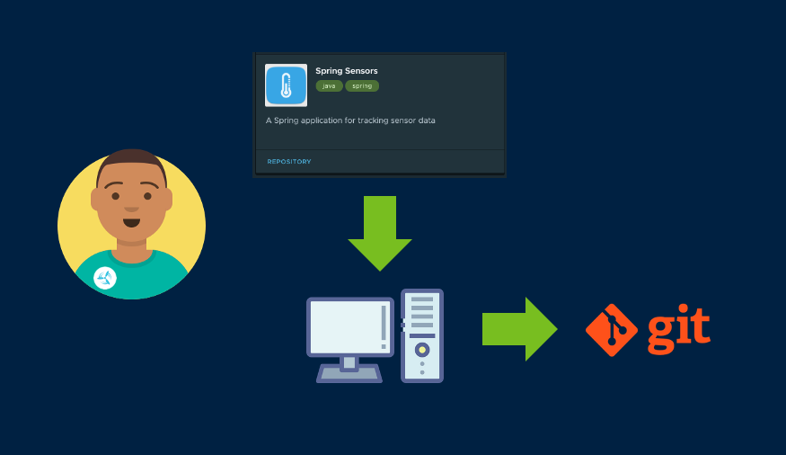

The accelerator contains a template for creating a cloud-native application that is compliant with Alana's enterprise governance standards, and the `workload.yaml` file for interfacing with Tanzu Application Platform. Cody does not need to provide any other configuration files, such as Dockerfiles or Kubernetes resources, that have dependencies on the target application infrastructure.

The workflow here is that Cody downloads the accelerator template to his local machine, customizes it to his needs, and then publishes it to a git Repo that we can hand off to Alana.



For this demo, we'll use the Tanzu command line interface instead of the Web UI to download the spring-sensors application accelerator. The Tanzu CLI is your one-stop shop for interacting with Tanzu Application Platform.

```execute
tanzu accelerator generate spring-sensors --server-url https://accelerator.tap.tanzutime.com --options='{"gitUrl": "'"$GITREPO"'","gitBranch":"main","ociCodeRepo":"'"$CODE_OCI_TARGET"'","advSettings":true,"devMode":true,"kubeContext":"eduk8s","securityConfig":"both","artifactId":"java-web-app"}'
```

Unzip the repo into your local file system:

```execute
unzip -o spring-sensors.zip && shopt -s dotglob && mv spring-sensors/* java-web-app/
```

Now lets take a look at the code in the VSCode editor:
  
`workload.yaml` is the Kubernetes YAML file needed to get this app running on the platform:

```editor:open-file
file: java-web-app/config/workload.yaml
```  
  
In the `workload.yaml` that was generated from the accelerator, we can see it pointing to a git repo we still did not create. We're still in our "Inner Loop" so we didn't commit any code yet.

Let's now take a look at our Spring Sensors java app code:
```editor:open-file
file: java-web-app/src/main/java/org/tanzu/demo/SensorsUiController.java
```
As we can see, our application is fetching sensor data from a database and returns it via this API call.

Tilt is an open source project for development against Kubernetes environments, and TAP has a very strong integration with Tilt. Tilt is configured per project via a simple config file called **Tiltfile** at the root of your project.

Lets see what our generated Tiltfile looks like:

```editor:open-file
file: java-web-app/Tiltfile
``` 

This file might look a bit daunting at first, but thanks to App Accelerator it is all generated boilerplate code, there is no need for the developer to change anything here.

Lets deploy this app from our local source code using the Tanzu extension for VSCode and Tilt, and then we will start to iterate over it before pushing our code to git.

```editor:execute-command
command: tanzu.liveUpdateStart
```
  
This will begin to build a container image for our application and then deploy it to our cluster. As this is the first run in can take around 5 minutes to complete.  
You will know it has completed when you see the output of the app itself running in the condole simillar to the bellow: 

  

Tilt automatically configures port forwarding for our app to our localhost at port 8080.  

Now lets check out our app:

```execute-2
curl http://localhost:8080
```

We get back an HTML response indicating that the app responds to our API.
The application is also accessible our web browser using the following URL. Clock on the link to open it:
```dashboard:open-url
name: Spring Sensors application
url: https://java-web-app-{{ session_namespace }}.apps.{{ ENV_BASE_DOMAIN }}
```
We just deployed our first application using Tanzu Application Platform!

We can see that our application pod is running as well:
```execute
kubectl get pods
```  
  
Now lets Look at the code we want to change:
```editor:select-matching-text
file: java-web-app/src/main/java/org/tanzu/demo/SensorsUiController.java
text: "model.addAttribute(\"sensors\", sensorRepository.findAll());"
```

If we'll take a look at the application again, we'll notice that the sensor data shows numbers that are not rounded nicely. Let's enhance the number formatting for the UI. Click below to update the the code and immediatly notice the logs changed in the VSCode terminal:

```editor:replace-text-selection
file: java-web-app/src/main/java/org/tanzu/demo/SensorsUiController.java
text: |
    var formattedSensorData = sensorRepository.findAll()
            .stream().map(s -> new SensorData(
                            s.getId(),
                            Math.round(s.getTemperature() * 100) / 100.0d,
                            Math.round(s.getPressure() * 100) / 100.0d
                    )
            ).collect(java.util.stream.Collectors.toList());
            model.addAttribute("sensors", formattedSensorData);
```

As we can see, logs ran for a few seconds at the bottom of our screen. Lets check out our app now:
```dashboard:open-url
name: Spring Sensors application
url: https://java-web-app-{{ session_namespace }}.apps.{{ ENV_BASE_DOMAIN }}
```
  
As we can see the app is Live Updated and our code changes are made immediately on our running Pod in the remote cluster.
  
Lets now stop our live update session:

```editor:execute-command
command: tanzu.liveUpdateStop
```

Our final step is to clean up the environment so we can move on to the next steps of deploying our app via GitOps:
```execute
tanzu apps workload delete java-web-app -y
```
