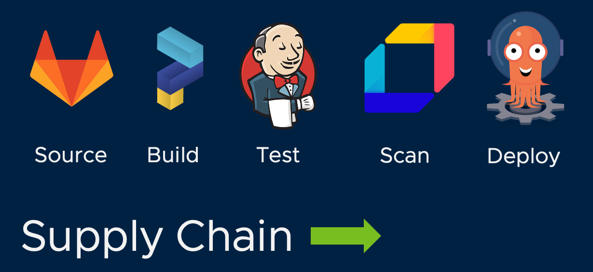
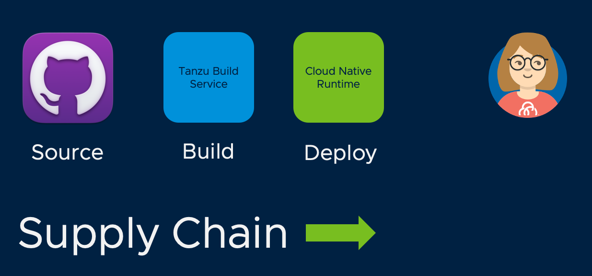

## Supply Chains

Alana works with Tanzu Application Platform by defining a **supply chain**. A supply chain defines a specific sequence of processing and tooling that defines the path to production that meets the governance standards at Alana's company:



This is Alana's supply chain, and she is free to customize it as she pleases: adding, removing, and swapping out components. This supply chain defines an automated, repeatable path to production for all applications being deployed to her clusters. Alana can define multiple supply chains to be used for different use cases.

For this demo, we are going to use a supply chain which retrieves application source from Git, scans it for vulnerabilities, creates a container image using Tanzu Build Service, runs an additional scan on the final image, and then deploys it using Cloud Native Runtime (powered by Knative).



The supply chain is managed by the **Supply Chain Choreographer (SCC)** component of Tanzu Application Platform. Supply Chain Choreographer is purpose built for managing the complete software supply chain cycle, from initial development through deployment to Kubernetes. A compliment to existing CI and CD tools (though it can certainly be used for that purpose), Supply Chain Choreographer is designed to coordinate across all tools involved in sourcing, building, testing, verifying, and deploying a software project.

Lets open up our Home Directory in VSCode so that we can see some example YAML manifests:  
```editor:execute-command
command: workbench.action.files.openFolder
args:
- uri: /home/eduk8s
```

To explore our supply chain, let's take a look at the supply chain definition we are using for "web" applications:
```editor:open-file
file: supplychain/ootb_supply_chain_basic.yaml
```
There are a few things to highlight in this file.

1. The ```spec/selector/app.tanzu.vmware.com/workload-type``` entry defines that tag that will be used in the workload.yaml file of any application that utilizes this supply chain.
2. The ```resources``` section has a sequential list of all the steps in the supply chain.

To understand what each resource does, you can take a look at the numbered definition files for each step in the supply chain, starting with ```supply-chain-01-source.yaml```:

```editor:open-file
file: supplychain/supply-chain-01-source.yaml
```

Now let's take a look at a different supply chain, which would take place if our application also has tests. Alana decided that workloads with tests will also run security scans, so the supply chain also integrates source code and image scanning:

```editor:open-file
file: supplychain/ootb_supply_chain_test_scan.yaml
```

Notice that ```spec/selector/app.tanzu.vmware.com/workload-type``` now have two parameters that have to exist in order for this supply chain to be picked up:

```
    apps.tanzu.vmware.com/has-tests: "true"
```

And:
```
    apps.tanzu.vmware.com/workload-type: web
``` 

# Monitoring Supply Chain Execution

The logs in the bottom terminal window show the progress of supply chain execution. When the build is complete, the container images are stored in a Harbor registry, from which deployment operations will pull those images. Let's now look at how TAP automates the deployment and execution of our application.
